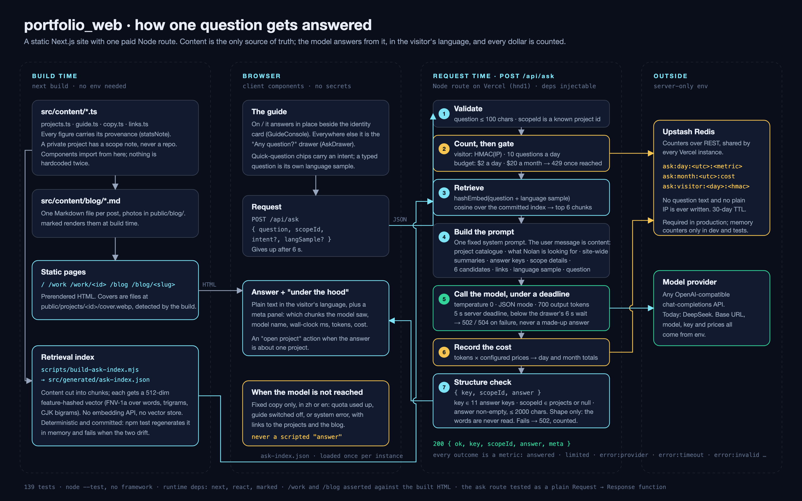

# portfolio_web

Nolan Tang's portfolio site, live at [nolan-tang.vercel.app](https://nolan-tang.vercel.app).
A static Next.js 16 site (App Router, TypeScript, no Tailwind) with one paid Node route:
a site guide that answers visitors' questions about the work, in the visitor's language,
from the site's own content — and stops the moment its budget is spent.



**Contents:** What this is · The guide, end to end · What it costs and how that is bounded · Content is the only source of truth · Run · Testing · Branching and release

## What this is

Three things live in this repository, in order of how much of the code they take:

1. **A site guide backed by a paid model** — `POST /api/ask`. On the home page it answers in
   place beside the identity card; on every other page it is the "Any question?" drawer.
   The model reads the site's content, answers in whatever language the visitor typed,
   says plainly when the site does not cover something, and never acts on Nolan's behalf.
2. **The work pages** — `/work` and one case page per project, prerendered from a single
   data file. Every figure shown carries a provenance note; a private project shows a
   scope note and never a repository link.
3. **A blog** — one Markdown file per post, rendered at build time. Publishing is adding a file.

The site runs on Vercel (Tokyo, `hnd1`), with Upstash Redis beside it for the guide's counters.

## The guide, end to end

The diagram above is the whole path. In words:

**Build time.** `scripts/build-ask-index.mjs` cuts `src/content` into chunks — every
project field, README excerpts by paragraph, what Nolan is looking for, the site-wide
summaries — and gives each a 512-dimension feature-hashed vector: FNV-1a over words and
character trigrams for Latin scripts, characters and bigrams for CJK. There is no embedding
API and no vector store. The vectors are a pure function of the text, so the index is
deterministic and committed (`src/generated/ask-index.json`); `npm test` regenerates it in
memory and fails when the two drift.

**Request time**, one Node function with every dependency injectable
(`src/server/ask/handler.ts`), in this order:

1. **Validate.** The question is at most 100 characters and the scope, if any, is a known
   project id. Anything else is a 400.
2. **Count, then gate.** Every request bumps a daily counter. The visitor is identified by an
   HMAC of their IP and allowed 10 questions a day; today's and this month's spend are
   checked against their thresholds. Over either limit is a 429 that names the reason.
3. **Retrieve.** The question (plus the language sample, see below) is hashed the same way
   as the index, and the six nearest chunks by cosine are picked.
4. **Build the prompt.** One fixed system prompt. The user message is content: the project
   catalogue, what Nolan is looking for, the site-wide summaries, the answer keys and what
   each means, the current scope's details, the six candidates, the public links, a
   target-language sample, and the question.
5. **Call the model under a deadline.** Any OpenAI-compatible chat-completions API
   (DeepSeek today), temperature 0, JSON mode, 700 output tokens, a 5-second server
   deadline kept below the drawer's 6-second wait. A failure is a 502 or 504 — never a
   made-up answer, never a scripted fallback.
6. **Record the cost.** Tokens times the configured prices, added to the day and month totals.
7. **Structure check.** The reply must be `{ key, scopeId, answer }` with a key from the
   eleven answer keys, a scope that is a project id or null, and a non-empty answer under
   2000 characters. Only the shape is checked; the words are never read. A reply that fails
   is a 502 and a counted error.

A 200 carries the answer plus a `meta` block — which chunks the model saw, model name,
wall-clock time, tokens and cost — that the page shows as "under the hood".

**Language.** A typed question is its own language sample. When the visitor clicks a
quick-question chip after typing in Chinese, the chip carries their last typed question
as the sample, so the answer stays in Chinese. The prompt tells the model that a mixed
sample takes the language of its sentence structure.

**Routing.** The model also routes: the same question in any language, or in other words,
gets the same answer key and scope. Site-wide keys (`payments`, `agents`, `looking`,
`contact`, `all`) always have a null scope; project keys (`overview`, `decision`, `stack`,
`status`, `code`) take the project the question names, or keep the current one. A paid
evaluation (`scripts/eval-ask.mjs`) checks that stability across English, Chinese, mixed and
other-language paraphrases, including chips clicked after a Chinese question.

**When the model is not reached** — quota used up, guide switched off, or a system error —
the page shows fixed copy in Chinese or English with links to the projects and the blog.
There is no mode in which the guide pretends to answer.

## What it costs and how that is bounded

Model calls are paid by Nolan. Three things keep that bounded:

| Limit | Default | Where |
| --- | --- | --- |
| Questions per visitor per day | 10 | `ASK_VISITOR_DAILY_LIMIT` |
| Spend per day | $2 | `ASK_DAILY_BUDGET_USD` |
| Spend per month | $20 | `ASK_MONTHLY_BUDGET_USD` |

Counters live in Upstash Redis, shared by every Vercel instance, under keys that carry the
UTC day or month and a hashed IP. No question text and no plain IP is ever written; every
key expires within 40 days. On Vercel's multiple instances, in-memory counters would only be
a weak per-instance limit, which is why production refuses to call the model without Upstash
and an `ASK_IP_SALT` (Upstash may incur additional charges). Outside production the counters
fall back to memory — the model is still called for real and still billed. Vercel's WAF adds
its own rate limit in front of the route.

Every outcome is a metric — `answered`, `limited:visitor`, `limited:budget`,
`error:provider`, `error:timeout`, `error:invalid`, `error:config`, `error:store` — so a
quiet guide can be told apart from a broken one by reading the counters.

## Content is the only source of truth

- `src/content/` holds every string, link and project record (`copy.ts`, `links.ts`,
  `projects.ts`, `guide.ts`). Components import from here and never hardcode a second copy.
- Every figure on the site comes from `projects.ts` and keeps its provenance label
  (`statsNote`). A private project (`private: true`) shows its scope note, never a repository.
- A project cover is a file: drop `public/projects/<id>/cover.webp` and the build picks it up.
- `src/content/blog/` — one Markdown file per post, photos in `public/blog/<slug>/`.
  `marked` renders them at build time; it is the one runtime dependency beyond Next and React.

The full contract — adding a project, covers, blog front matter, figures — is in
[`CONTENT.md`](CONTENT.md).

## Run

```bash
npm install
npm run dev     # http://localhost:3000
npm test        # content rules, the ask route, /work and /blog against the built HTML
npm run lint
npm run build   # needs no env
```

### Env for `/api/ask`

Copy `.env.example` to `.env.local`. Every variable is server-only. Without the model
variables the route answers 503 and the rest of the site is unaffected.

| Variable | Purpose |
| --- | --- |
| `ASK_MODEL_BASE_URL`, `ASK_MODEL`, `ASK_MODEL_API_KEY` | The OpenAI-compatible endpoint and key |
| `ASK_PRICE_INPUT_USD_PER_MTOK`, `ASK_PRICE_OUTPUT_USD_PER_MTOK` | Prices used to record cost; no defaults |
| `UPSTASH_REDIS_REST_URL`, `UPSTASH_REDIS_REST_TOKEN`, `ASK_IP_SALT` | Counters and the visitor hash; required in production |
| `ASK_DAILY_BUDGET_USD`, `ASK_MONTHLY_BUDGET_USD`, `ASK_VISITOR_DAILY_LIMIT` | The limits above |
| `ASK_SERVER_DEADLINE_MS` | Must stay below the drawer's 6000 ms wait |
| `ASK_ENABLED` | `false` switches the guide off; anything else leaves it on |

### After editing content

```bash
node scripts/build-ask-index.mjs   # rebuild and commit the retrieval index
```

### Evaluation (paid)

```bash
node scripts/eval-ask.mjs --runs 2
```

## Testing

`npm test` is `node --test` over `tests/*.test.mjs` — no test framework, Node's own runner
with TypeScript types stripped. The route is tested as a plain `Request → Response`
function with a fake provider, a fake store and a fixed clock; the pages are tested by
running `next build` and asserting on the HTML it writes. The one paid check, the
evaluation above, is a script rather than a test.

## Branching and release

- `main` is protected: no direct pushes, no force-pushes, no deletion. Every change lands
  through a pull request; no reviewer is required, the PR is the speed bump.
- Day-to-day work happens on `dev` and on task branches cut from it.
- Release = open a PR `dev → main` and merge it; Vercel deploys `main`.
